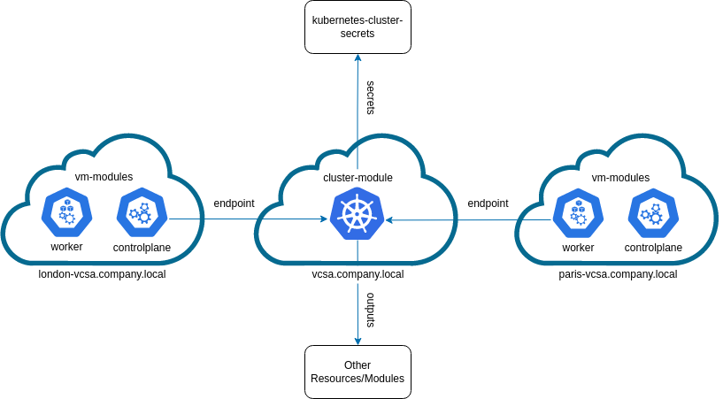

# Talos vSphere Cluster Terragrunt Example

This example demonstrates an infrastructure in which your company has 3 datacenters at 3 different vSphere regions - `local`, `london` and `paris` (all networks are accessible to each other).

[kubernetes-cluster-secrets](https://github.com/ilpozzd/terraform-talos-secrets) is created in the `_global_data` folder, which is used as a dependency for a [kubernetes-cluster](https://github.com/ilpozzd/terraform-talos-vsphere-cluster) on a `local` region, which consists of 2 controlplane nodes (the first node is init), and for controlplane and worker [virtual machines](https://github.com/ilpozzd/terraform-talos-vsphere-vm) on regions in `london` and `paris`, which use the [kubernetes-cluster](https://github.com/ilpozzd/terraform-talos-vsphere-cluster) as a dependency for automatic API endpoint detection.

* Set your credentials in `credentials.hcl` file. It is absolutely not recommended to store this file in the repository, add it to `.gitignore`
* Go to `infrastructure` folder and run `terragrunt run-all` commands to change resources in all sites
* Go to `infrastructure/<region name>` and run `terragrunt run-all` commands to change resources in specific region (e.g. `london`)
* You can create any file structure in `infrastructure/<region name>` folder and apply only specific resources by `terragrunt` command
